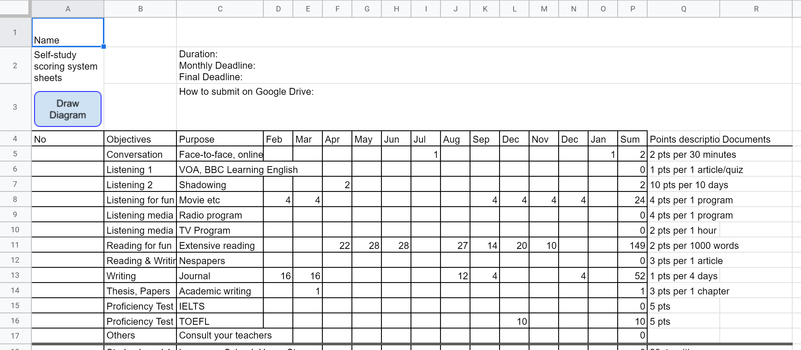
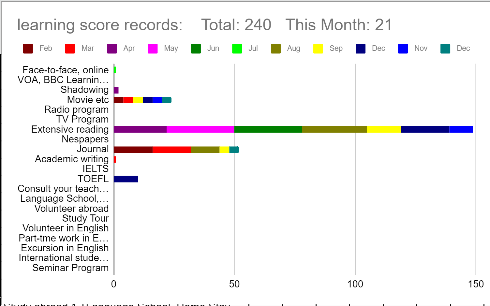

# learning_score_records 
This is a learning score record spreadsheet for autonomous learning in educational setting, originally made by Atsushi Iino. The teacher determine score points for each activity students will do during a year. Students write score points on the sheets monthly, submitting documents to the classroom google drive. Both the teacher and students can view the learning history in a diagram. 
 
You can download the spreadsheet from the links below. Open and save a copy on your google drive: 
&nbsp;&nbsp;&nbsp;&nbsp;English version: <a href="https://docs.google.com/spreadsheets/d/16hLQmXEAEcdG2GOt2mo261Hpb85gV-xhGiO0sGkmue0">here</a> 
&nbsp;&nbsp;&nbsp;&nbsp;Japanese version: <a href="https://docs.google.com/spreadsheets/d/1YaTYJLhb2AD5tVltsfaWXbA5anwEORnpmCrSffXqtIA">here</a> 
 
The teacher can implement the autonomous learning through e-portfolio as below: 
&nbsp;&nbsp;&nbsp;&nbsp;a) The teacher determines activities and score points. 
&nbsp;&nbsp;&nbsp;&nbsp;b) The teacher determines both the least monthly points and yearly one students should achieve. 
&nbsp;&nbsp;&nbsp;&nbsp;c) The teacher determines the duration, deadlines, and how to hand in the learning documents. The shared Google drive would be better. 
&nbsp;&nbsp;&nbsp;&nbsp;d) Students fill in the spreadsheet to show how many points they achieve during the month and submit their documnets. 
&nbsp;&nbsp;&nbsp;&nbsp;e) The teacher makes sure and manage the progress of students' learning by the spreadsheets and its diagrams. 
 
The spreadsheet is as below. Students learn by themselves. They record their points monthly and submit the releavant documents.  
  
The spreadsheet includes 'Draw Diagram' button. When you push the button, a stacked bar chart as below comes up to show the whole total points and monthly points the student achieves. The student, or the teacher, can use the diagram to manage his/her learning. The word 'Total' means the total points, and 'This Month' means monthly points the student achieve--Check it before the following month begins. The color designates in which month the student learns. When the student finished seeing the diagram, s/he can delete the diagram by clicking the diagram itself, clicking the three dots on the right top corner and selecting the 'delete graph' on the pop-up window.     
 
